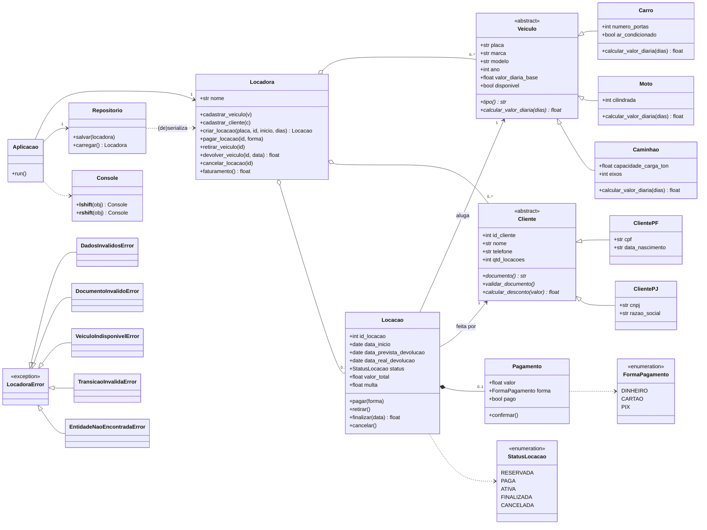
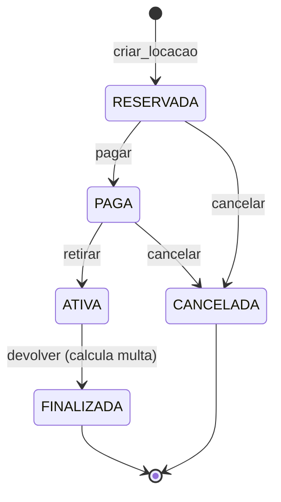

# Diagrama de Classes — Locadora de Veículos

> Renderiza automaticamente no GitHub. Versão PlantUML em
> [`diagrama_uml.puml`](diagrama_uml.puml).

```mermaid
classDiagram
    direction LR

    class Veiculo {
        <<abstract>>
        +str placa
        +str marca
        +str modelo
        +int ano
        +float valor_diaria_base
        +bool disponivel
        +tipo() str*
        +calcular_valor_diaria(dias) float*
    }
    class Carro {
        +int numero_portas
        +bool ar_condicionado
        +calcular_valor_diaria(dias) float
    }
    class Moto {
        +int cilindrada
        +calcular_valor_diaria(dias) float
    }
    class Caminhao {
        +float capacidade_carga_ton
        +int eixos
        +calcular_valor_diaria(dias) float
    }
    Veiculo <|-- Carro
    Veiculo <|-- Moto
    Veiculo <|-- Caminhao

    class Cliente {
        <<abstract>>
        +int id_cliente
        +str nome
        +str telefone
        +int qtd_locacoes
        +documento() str*
        +validar_documento()*
        +calcular_desconto(valor) float*
    }
    class ClientePF {
        +str cpf
        +str data_nascimento
    }
    class ClientePJ {
        +str cnpj
        +str razao_social
    }
    Cliente <|-- ClientePF
    Cliente <|-- ClientePJ

    class Locacao {
        +int id_locacao
        +date data_inicio
        +date data_prevista_devolucao
        +date data_real_devolucao
        +StatusLocacao status
        +float valor_total
        +float multa
        +pagar(forma)
        +retirar()
        +finalizar(data) float
        +cancelar()
    }
    class Pagamento {
        +float valor
        +FormaPagamento forma
        +bool pago
        +confirmar()
    }
    class StatusLocacao {
        <<enumeration>>
        RESERVADA
        PAGA
        ATIVA
        FINALIZADA
        CANCELADA
    }
    class FormaPagamento {
        <<enumeration>>
        DINHEIRO
        CARTAO
        PIX
    }

    class Locadora {
        +str nome
        +cadastrar_veiculo(v)
        +cadastrar_cliente(c)
        +criar_locacao(placa, id, inicio, dias) Locacao
        +pagar_locacao(id, forma)
        +retirar_veiculo(id)
        +devolver_veiculo(id, data) float
        +cancelar_locacao(id)
        +faturamento() float
    }
    class Repositorio {
        +salvar(locadora)
        +carregar() Locadora
    }
    class Aplicacao {
        +run()
    }
    class Console {
        +__lshift__(obj) Console
        +__rshift__(obj) Console
    }

    Locacao --> "1" Veiculo : aluga
    Locacao --> "1" Cliente : feita por
    Locacao *-- "0..1" Pagamento
    Locacao ..> StatusLocacao
    Pagamento ..> FormaPagamento

    Locadora o-- "0..*" Veiculo
    Locadora o-- "0..*" Cliente
    Locadora o-- "0..*" Locacao

    Aplicacao --> "1" Locadora
    Aplicacao --> "1" Repositorio
    Aplicacao ..> Console
    Repositorio ..> Locadora : (de)serializa

    class LocadoraError {
        <<exception>>
    }
    LocadoraError <|-- DadosInvalidosError
    LocadoraError <|-- DocumentoInvalidoError
    LocadoraError <|-- VeiculoIndisponivelError
    LocadoraError <|-- TransicaoInvalidaError
    LocadoraError <|-- EntidadeNaoEncontradaError
```

## Máquina de estados da Locação

```mermaid
stateDiagram-v2
    [*] --> RESERVADA : criar_locacao
    RESERVADA --> PAGA : pagar
    RESERVADA --> CANCELADA : cancelar
    PAGA --> ATIVA : retirar
    PAGA --> CANCELADA : cancelar
    ATIVA --> FINALIZADA : devolver (calcula multa)
    FINALIZADA --> [*]
    CANCELADA --> [*]
```
